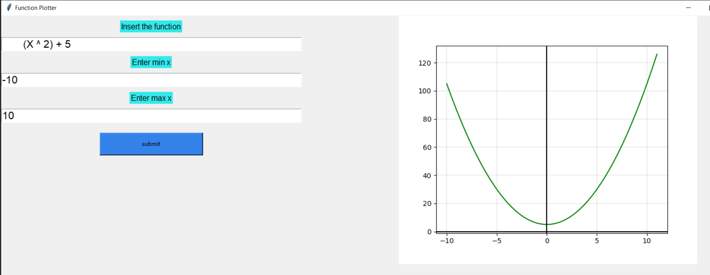
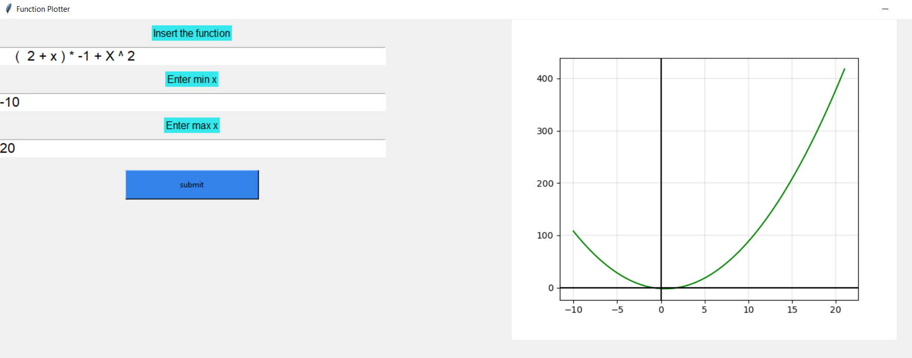

# MasterMicro_task1

## 📙About
A very simple Gui that draws a given equation from the user
## 🏁Getting Started
- You need an IDE to run this code like Vscode.
- Install anaconda packages in order to open Jupter Note Book.
- Install Visual Studio Code.
- Open the project
- Run all cells.
## 💻Built Using
- anaconda python (base 3.8.8)
## 📷Screenshots
### Working Examples

### Non working examples 

